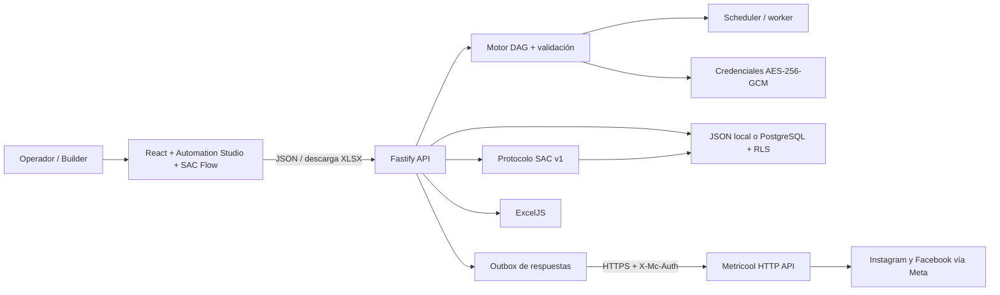
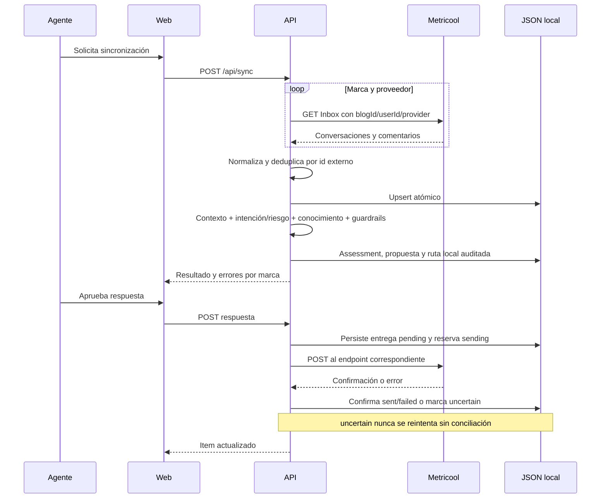
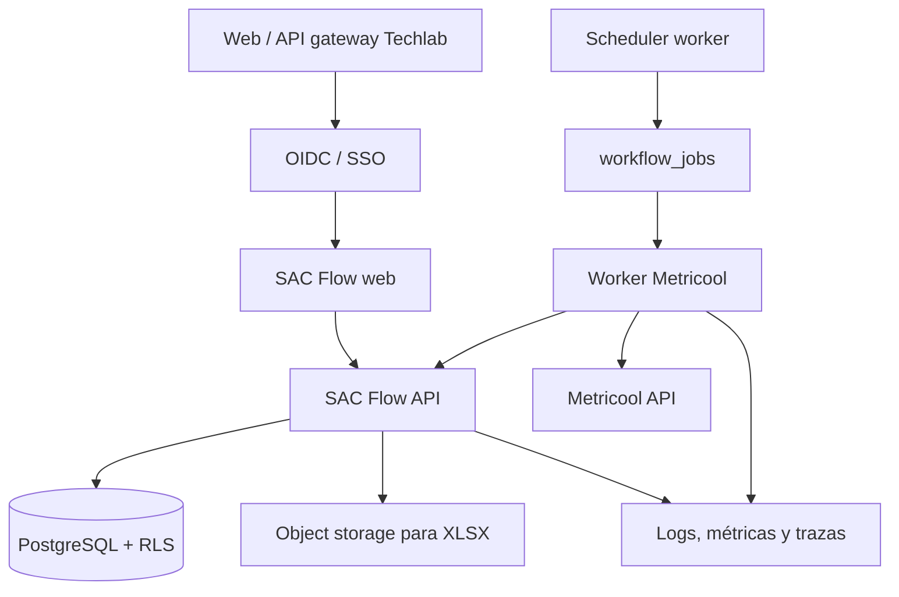

# Arquitectura de Flow Studio y SAC Flow

## Propósito y alcance

Flow Studio es una beta de automatización general construida alrededor del módulo SAC Flow. La plataforma permite diseñar, versionar, publicar y ejecutar DAGs con triggers, transformaciones, ramas, datos, HTTP y subworkflows. SAC Flow centraliza la atención de aproximadamente 20 marcas conectadas a Metricool y mantiene su interfaz, datos y controles especializados.

La arquitectura fue informada por una auditoría local del repositorio oficial de n8n, pero el código es original y su alcance es una beta profesional, no paridad total ni un sistema productivo multiempresa.

## Contexto

Metricool sigue siendo el sistema externo que obtiene y publica mensajes/comentarios. SAC Flow agrega una vista multicuenta, normaliza los datos y conserva una copia operativa local porque el Inbox de Metricool no almacena historial permanente.

## Componentes

### Frontend

- React/Vite con shell general y carga diferida de los editores React Flow.
- Automation Studio incluye inicio, listado, editor, catálogo, inspector, plantillas, ejecuciones, credenciales y variables.
- Canvas y vistas operativas para el flujo, las marcas, la bandeja, el detalle de caso, las métricas y los ajustes.
- **Gestión manual por cuenta** sigue un modelo account-first de tres paneles. En DMs, la cola permanece centrada en personas; en comentarios, la primera columna cambia a publicaciones y la segunda muestra los comentarios abiertos exactos del post seleccionado. Los posts usan `publishedAt DESC`; cuando el proveedor no entrega esa fecha, `sortSource=latest_comment_at` hace explícito el fallback. La cola dentro del post usa comentarios inbound abiertos en orden ascendente para atender primero el SLA más antiguo. Cambiar de cuenta descarta publicaciones, comentarios y selección anterior para impedir cruces de marca.
- Run/sync/export consumen el contrato interno. Dashboard, cuentas, bandeja, detalle de conversación y reglas globales leen `brands`, `accounts/:accountId/metricool`, `inbox/contacts`, `inbox/posts`, `inbox/posts/:postKey/comments`, `interactions/:id`, `stats` y `workflow` desde la API mediante un mapper de frontend. La bandeja principal usa un DTO minimizado y paginado después de agrupar por persona dentro de cuenta+plataforma; Gestión manual pagina resúmenes por publicación y carga comentarios pendientes bajo demanda. Ambas conservan por separado el `replyTarget` exacto. Las claves visuales de contacto y publicación nunca reemplazan `conversationKey`, que sigue siendo el hilo estricto usado por protocolo y reconciliación. El panel solicita historial con `scope=contact`, puede ejecutar `sac-v1` sobre casos existentes y muestra ruta, riesgo, conocimiento y contexto del post. Mientras permanece visible, relee datos locales cada 30 segundos, pausa el polling al ocultarse y nunca convierte ese timer en un `POST /sync`; el botón manual sí fuerza una lectura de Metricool y después actualiza la vista sin navegar fuera de ella. La bandeja y el panel de detalle crean borradores, resuelven y escalan casos por API; los toggles de automatización actualizan la allowlist del workflow. La vista de cuentas guarda/elimina referencias `userId`/`blogId` por API sin exponerlas en respuestas y permite crear, editar o desactivar marcas/cuentas internas. Rotación de token y gestión productiva de credenciales siguen pendientes.
- El composer usa el `replyTarget.id` recibido por la API y nunca una identidad visual o el último mensaje como sustituto. Guardar borrador es local; enviar requiere acción y confirmación humana, `expectedVersion` vigente e `Idempotency-Key`. El polling visible solo relee por GET y preserva selección/borrador; no llama a sincronización, evaluación SAC ni respuesta.
- Para comentarios, el panel derecho muestra únicamente el contexto de publicación entregado por el proveedor. Miniatura y permalink deben ser HTTPS; el enlace se abre aislado, `publishedAt` solo se presenta cuando existe y la ausencia de contexto o fecha se representa sin fabricar URLs ni timestamps.
- El canvas especializado de Flujo SAC inicia bloqueado, refleja el permiso `supervisor` del backend y persiste `connectorType` por edge. Los tipos curvo, recto y ortogonal cambian solo el trazado visual; ciclos, huérfanos y rutas obligatorias siguen bajo `validateWorkflow` antes de publicar.
- El navegador nunca recibe el token de Metricool.
- `VITE_API_BASE_URL` permite mover la API detrás de un gateway de Techlab; `VITE_APP_BASE_PATH` permite montar la web bajo un prefijo como `/sac/`.

### API

- Fastify registra el contrato general `/api/platform/*`, webhooks `/api/webhooks/:path` y el contrato especializado SAC.
- El servicio general administra proyectos, carpetas, tags, credenciales, variables, workflows, versiones y ejecuciones; los cambios del estado general se serializan mediante `mutateAutomation`.
- El motor ejecuta grafos acíclicos en orden topológico, enruta salidas nombradas, interpola expresiones y registra cada node run.
- La validación bloquea tipos desconocidos, parámetros faltantes, referencias inválidas, salidas inexistentes, ciclos y borradores activos no publicados.
- Fastify expone salud, configuración operativa, marcas, estado seguro de referencias Metricool por cuenta, bandeja, detalle con auditoría/asignación/notas/versionado, sincronización, respuestas, métricas y exportación.
- Valida los payloads antes de escribir o llamar a Metricool.
- Puede leer contexto temporal `X-SAC-*` desde un gateway confiable para aplicar rol mínimo y scope de marca. `/api/me` entrega al navegador solo el contexto necesario para adaptar controles visibles; la autorización definitiva permanece en cada endpoint. Esto prepara SSO/RBAC, pero no lo reemplaza.
- Encapsula la traducción entre el modelo de Metricool y el modelo estable de SAC Flow.
- `server/sac-automation.ts` ejecuta un protocolo determinista para cada interacción nueva: arma contexto, clasifica intención/riesgo, exige conocimiento aprobado o fuente en vivo, valida ventana/horario/publicación/allowlist y decide `auto_reply`, `draft`, `human_review`, `quarantine` o `ignore`. En `shadow` las candidatas quedan como borrador medible; en `live` se preparan como `pending` y `server/auto-reply-outbox.ts` crea una entrega durable idempotente.
- ExcelJS genera un libro descargable; no se usa Excel como base de datos.

### Persistencia local

- Un archivo JSON permite arrancar el MVP sin infraestructura adicional.
- `server/repository-contract.ts` define la frontera que debe implementar cualquier repositorio. `JsonRepository` es solo el adaptador local.
- `SAC_FLOW_REPOSITORY=json|postgres` hace explícito el driver esperado; seleccionar `postgres` sin adaptador conectado falla al arrancar y `json` queda bloqueado en live/producción salvo opt-in temporal.
- Las escrituras deben ser atómicas y serializadas para evitar archivos parciales.
- Esta persistencia es adecuada para demo/desarrollo de una sola instancia, no para concurrencia productiva.
- El esquema objetivo de PostgreSQL vive en `db/migrations/` e incluye tenant, RLS, auditoría, idempotencia, coordinación SAC, jobs generales y un documento JSONB de estado para la beta de Automation Studio. `PostgresRepository` ya está conectado al selector runtime; `snapshotAutomation` y `mutateAutomation` leen/actualizan solo ese documento y evitan borrar o reinsertar marcas, interacciones y jobs. Sigue pendiente normalizar tablas de gran volumen y validar migración/concurrencia contra PostgreSQL real.

### Motor general

- `server/automation-catalog.ts` declara tipos, parámetros, salidas y credenciales compatibles.
- `server/automation-validation.ts` valida estructura y publicabilidad.
- `server/automation-engine.ts` ejecuta localmente sin `eval` ni código arbitrario.
- `server/automation-service.ts` aplica versionado, vault, políticas de salida, subworkflows, límite transaccional de concurrencia, redacción antes de persistir, historial y dispatch de workflow de errores.
- `server/worker.ts` agenda la ingesta SAC de solo lectura cuando `SAC_FLOW_INBOX_SYNC_ENABLED=true`, con el intervalo del workflow pero sin depender de activar su protocolo, además de los workflows generales con trigger horario. Consume también la cola de auto-respuestas y expone un probe interno independiente en `SAC_FLOW_WORKER_HEALTH_PORT`. La sincronización de lectura no habilita respuestas: el despacho solo opera con modo live y los dos cortacorrientes externos desactivados. Un `429` confirmado conserva la misma entrega, respeta `Retry-After` y aplica cooldown a esa cuenta mientras las demás continúan. Solo se arrienda una entrega por cuenta; timeout/5xx permanece `uncertain` y activa un breaker durable hasta la conciliación supervisada. La cola automática tiene un máximo configurable reservado atómicamente bajo el lock/transacción del repositorio; al saturarse deja las candidatas como casos locales visibles y publica señal en readiness, configuración y métricas.
- `SAC_FLOW_DISABLE_EXTERNAL_NODES=true` y `SAC_FLOW_DISABLE_METRICOOL_MUTATIONS=true` mantienen las salidas bloqueadas durante desarrollo.

### Adaptador de Metricool

- Base oficial: `https://app.metricool.com/api`.
- Autenticación servidor a servidor con `X-Mc-Auth`; `userId` y `blogId` acompañan cada llamada.
- Lectura por marca y proveedor desde los endpoints Inbox, usando `INSTAGRAMBUSINESS`/`INSTAGRAM` según la conexión de cada cuenta y `FACEBOOK` para páginas.
- Normalización contractual de `Conversation.messages[]` y `PostCommentsThread.root/comments[]`; conserva `recipient` u `objectId` para responder con el payload oficial. Para comentarios minimiza `root.element` a ID, enlace HTTP(S), texto y primer medio, y conserva el ID del actor sin correo ni payload crudo. Una resincronización puede enriquecer únicamente estos metadatos fuente en duplicados; nunca reemplaza estado, versión, asignación, auditoría o borradores locales.
- Respuestas de DM y comentarios por endpoints separados.
- El MVP usa polling explícito; no asume webhooks de nuevos mensajes.

### Exportación

El libro XLSX debe contener una hoja de detalle con una fila por DM/comentario y una hoja de resumen con recuentos por marca, red, tipo y estado. La exportación es una fotografía del estado filtrado en el momento de la solicitud.

## Flujo de datos

Una falla en una marca no debe borrar datos previos ni convertir el lote completo en éxito. El resultado de sincronización debe conservar el detalle por marca para permitir reintentos.

## Modelo canónico

El frontend y Excel trabajan con un item normalizado, independiente del payload crudo de cada red:

- `id`: identificador interno estable.
- `externalId`: identificador de Metricool/red usado para deduplicar.
- `brandId` y `accountId`; `brandName`/`accountHandle` se derivan para la vista de detalle y `blogId` permanece solo del lado servidor.
- `provider`: `INSTAGRAM` o `FACEBOOK` en el alcance inicial.
- `kind`: `dm` o `comment`.
- `author`, `text`, `receivedAt` y referencia de conversación/publicación.
- `status`: estado operativo local.
- `automation`: assessment versionado `sac-v1` con intención, riesgo, estado de conocimiento, contexto conversacional, ventana, ruta recomendada/efectiva, motivos y propuesta.
- elegibilidad derivada para automatización: comentarios >24 h y DMs >7 días pasan a revisión humana. Un agente puede intentar el envío manual; Metricool/Meta determinan la aceptación final y el outbox registra el resultado.
- historial durable de entregas y errores sanitizados, sin almacenar el token.

El contrato concreto y las rutas vigentes están en [API_CONTRACT.md](./API_CONTRACT.md).

## Modos

### Demo

- Es el valor explícito `METRICOOL_MODE=demo` y no requiere token.
- Carga 20 marcas ficticias y conversaciones de muestra.
- No requiere credenciales ni envía respuestas reales.
- Debe mostrar de forma visible que los datos son simulados.

### Metricool real

- Requiere `METRICOOL_MODE=live`, plan Advanced o Custom, token, `userId` y `blogId` válido por marca.
- Mantiene las llamadas y los secretos exclusivamente en el servidor.
- Falla cerrado si falta token o API key requerida; la API key es una barrera temporal de integración, no sustituye SSO/RBAC.
- Falla cerrado si se intenta usar JSON como persistencia live en producción sin una excepción explícita.
- `SAC_FLOW_DISABLE_OUTBOUND_SENDS=true` bloquea cualquier envío externo y conserva borradores, útil para UAT, incidentes, rollback o cortes controlados.
- El envío se controla mediante la configuración del workflow y permanece desactivado por defecto: `autoReplyEnabled=false` y `autoReplyAccountIds=[]`. Cada marca debe aprobarse explícitamente antes de abandonar draft-only.

## Límites deliberados de la release candidate

- JSON queda limitado al desarrollo/demo. El compose productivo usa PostgreSQL, migraciones con checksum, API y worker separados.
- `PostgresRepository` implementa pool, transacciones, contexto tenant, RLS, cifrado de referencias Metricool, versiones de workflow y trabajos durables. El límite pendiente es operativo: smoke local después del reinicio de Windows, backups/restore y observabilidad de base en el ambiente definitivo.
- Sin SSO propio: el puente `X-SAC-*` aplica rol/scope si Techlab lo entrega desde un gateway confiable, pero la identidad definitiva debe venir de OIDC/BFF.
- Existe scheduler/cola durable PostgreSQL con clave única por workflow/intervalo, leasing, recuperación, backoff y estado `dead`. Los jobs de ingesta aceptan hasta 5.000 items como cortafuegos explícito, alineado con `POST /api/sync`; la paginación del proveedor ocurre antes de ese límite. La vista `Ejecuciones` expone los estados `dead`/`retry` a supervisores y reserva el reencolado confirmado para administradores. Para respuestas, el outbox evita reintentos ciegos y fuerza conciliación ante ambigüedad; la garantía exactamente una vez absoluta sigue dependiendo de una clave idempotente o consulta de estado ofrecida por el proveedor y de pruebas concurrentes reales.
- Sin almacenamiento de adjuntos.
- Sin entrenamiento ni respuesta generativa autónoma; `sac-v1` usa reglas y respuestas aprobadas auditables. Precio, stock, despacho y seguimiento permanecen en borrador hasta incorporar una fuente en vivo.
- El outbox y la conciliación local están implementados en JSON/PostgreSQL. Sigue pendiente validar con la API real qué referencia devuelve Metricool y si ofrece consulta o idempotencia nativa para automatizar parte de la conciliación.
- No intenta eludir las restricciones de Meta/Metricool: la automatización respeta sus plazos y los intentos manuales fuera de plazo quedan advertidos, auditados y sujetos al rechazo del proveedor.

## Arquitectura objetivo en Techlab

La topología PostgreSQL/API/worker ya está codificada en `docker-compose.production.yml`. La promoción al sitio existente conserva el contrato HTTP; siguen siendo externos la identidad OIDC/BFF, object storage si se adopta y la observabilidad central.

## Decisiones que Techlab debe cerrar

- Proveedor OIDC y mapeo de grupos a roles.
- Tenancy: una organización con 20 marcas o varias organizaciones aisladas.
- Frecuencia y presupuesto de polling según límites reales de Metricool.
- Retención y anonimización de DMs/comentarios.
- Uso de IA, proveedor, residencia de datos y aprobación humana.
- Destino del XLSX: descarga síncrona, object storage o integración Microsoft 365.
- SLO, alertas, RPO/RTO y ventana de mantenimiento.
