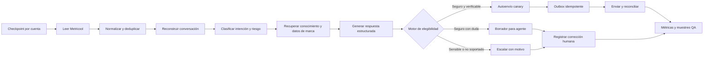

# Auditoría histórica del protocolo de automatización SAC

> Este documento conserva la línea base anterior a `sac-v1`. Desde esa auditoría se implementaron contexto conversacional, políticas por marca, conocimiento aprobado, horarios, outbox transaccional, conciliación, modo sombra y despacho asíncrono gobernado. Para el estado vigente use `ARCHITECTURE.md` y `PROFESSIONAL_COMPLETION_CHECKLIST.md`.

Fecha: 13 de agosto de 2026  
Alcance: Centro SAC, bandeja, detalle de caso, flujo especializado, evaluaciones y runtime local.  
Objetivo: determinar si el área SAC puede operar mayoritariamente mediante respuestas automatizadas con revisión humana por excepción.

## Dictamen

Sí, el flujo puede mejorar de forma sustancial, pero hoy no está listo para automatizar la mayor parte de SAC. El canvas representa una arquitectura adecuada como intención; el runtime actual ejecuta principalmente captura, normalización, deduplicación y persistencia. La clasificación y el autoenvío no están encadenados a la sincronización real.

Estado comprobado del entorno local:

- 340 interacciones demo acumuladas; 310 pendientes.
- 0 respuestas automatizadas y `autoReplyEnabled=false`.
- allowlist de autoenvío vacía.
- las interacciones reales normalizadas desde Metricool nacen como `sin_clasificar`, confianza `0` y por ello requieren revisión humana con la política actual;
- cada sincronización demo crea IDs externos nuevos, por lo que infla el volumen y no sirve para medir deduplicación o cobertura de automatización entre ejecuciones;
- la UI carga como máximo las primeras 200 interacciones aunque el resumen contabiliza más.

La preparación específica para SAC mayoritariamente automatizado se evalúa en **3/10**. No es una evaluación de la plataforma general tipo n8n, sino del protocolo de respuesta SAC end-to-end.

## Flujo auditado

### 1. Centro de operaciones — saludable como entrada

Fortalezas:

- prioriza carga pendiente, revisión humana, asignación y estado de cuentas;
- separa claramente datos demo, flujo activo y protección Metricool;
- navegación, jerarquía y CTA principal son entendibles.

Brecha principal: no separa cuánto trabajo es `auto-resoluble`, `borrador automático`, `humano obligatorio` o `bloqueado`. Para dirigir SAC por excepción, esa distribución debe ser la primera métrica operativa.

### 2. Bandeja multicuenta — parcial

Fortalezas:

- filtros por cuenta, asignación, canal, tipo y estado;
- selección masiva y tabla semántica;
- canal, marca y estado son fáciles de recorrer.

Riesgos:

- no muestra decisión de automatización, motivo, confianza calibrada, SLA, ventana restante ni fuente factual;
- la acción `Borrador` usa una respuesta genérica y no responde la consulta concreta;
- solo se cargan 200 filas en cliente, sin paginación visible, aunque existen más casos;
- las acciones masivas seleccionan por estado, no por elegibilidad determinista.

### 3. Detalle de caso — parcial

Fortalezas:

- expone marca, canal, categoría, confianza, versión, asignación y ventana de respuesta;
- tiene control optimista de versión, notas internas y auditoría;
- conserva borrador, escalamiento y resolución como acciones separadas.

Riesgos:

- el borrador aparece vacío y no existe propuesta explicada por el sistema;
- no se ve historial conversacional, hechos recuperados, fuente de cada dato ni razón exacta de la decisión;
- `89%` no está respaldado por evaluación o calibración real;
- la aprobación humana no registra correcciones estructuradas que puedan mejorar reglas, plantillas o modelos.

### 4. Canvas SAC — arquitectura correcta, ejecución incompleta

Fortalezas:

- cubre ingestión multicuenta, normalización, deduplicación, clasificación, guardrails, revisión, envío y errores;
- distingue ramas segura y humana;
- incluye versión, publicación y cortacorriente.

Brechas del runtime:

- `/api/sync` termina después de persistir y registra `drafted=0`, `replied=0`, `escalated=0`;
- la simulación calcula conteos, pero no genera ni guarda respuestas;
- el canvas especializado no es la fuente ejecutable del proceso;
- la clasificación general existente es una regla por palabras con dos resultados (`general`/`sensible`), no un clasificador SAC operativo;
- no hay base de conocimiento, catálogo factual, historial de conversación ni herramientas de consulta por marca;
- `businessHoursOnly` se persiste pero no se aplica;
- el ajuste visual de sentimiento negativo no se persiste como política independiente;
- no existe reserva transaccional/outbox antes de contactar al proveedor.

Riesgo de accesibilidad: al ajustar los 18 nodos a pantalla, el texto se vuelve muy pequeño; los nodos se exponen como contenido genérico dentro de una aplicación y falta confirmar navegación completa por teclado y lector de pantalla.

### 5. Evaluaciones — insuficiente

La pantalla valida integridad del grafo, versiones y advertencias estructurales. No mide lo necesario para permitir autoenvío:

- precisión por intención y marca;
- falsos autoenvíos y falsos escalamientos;
- cobertura de base de conocimiento;
- calidad factual y de tono;
- confianza calibrada;
- cambios del agente frente al borrador;
- cumplimiento de ventanas y políticas;
- comparación shadow/canary entre versiones.

## Protocolo objetivo

## Cambios P0 antes de autoenvío

1. Convertir el protocolo SAC en una máquina de estados ejecutable y durable; el canvas debe configurar ese mismo runtime.
2. Encadenar cada interacción nueva: contexto → clasificación → conocimiento → propuesta → elegibilidad → acción.
3. Crear reglas versionadas por marca: tono, idioma, categorías permitidas, horarios, plantillas, fuentes y umbral calibrado.
4. Incorporar contexto conversacional y distinguir primer contacto, continuación, respuesta ya enviada y mensaje duplicado.
5. Añadir base de conocimiento aprobada. Precio, stock, pedido y despacho dinámicos solo pueden auto-responder con una fuente consultada en tiempo real.
6. Hacer que el generador produzca salida estructurada: intención, riesgo, hechos utilizados, borrador, confianza, motivos de bloqueo y versión de modelo/prompt.
7. Implementar un motor determinista de elegibilidad. Debe revalidar cuenta, canal, dirección, ventana, categoría, confianza, hechos, idioma, PII, horario, publicación y duplicados justo antes de enviar.
8. Reservar el envío mediante outbox transaccional y reconciliar la confirmación de Metricool; una caída entre proveedor y persistencia no puede duplicar la respuesta.
9. Sustituir las evaluaciones actuales por un banco de casos anonimizados con resultados esperados, métricas por marca/categoría y regresión entre versiones.
10. Implementar shadow mode y despliegue `1 → 4 → 20` cuentas, con muestreo QA y rollback automático por tasa de error.

## Segmentación recomendada

| Nivel | Acción | Ejemplos iniciales |
| --- | --- | --- |
| A | Auto-responder | FAQ estática y aprobada: horarios, ubicación, canales de contacto, cobertura general |
| B | Auto-responder solo con fuente viva | precio, stock, estado de pedido, despacho específico |
| C | Crear borrador | pregunta ambigua, baja cobertura, conversación con contexto incompleto |
| D | Humano obligatorio | reclamo, pago/fraude, legal, salud, amenaza, seguridad, datos personales, sentimiento negativo |
| E | Resolver sin respuesta o cuarentena | spam, duplicado, formato no soportado, error de proveedor |

## Métricas de aceptación

- `automation_eligible_rate`: porcentaje que cumple todas las reglas antes de enviar;
- `automation_sent_rate`: porcentaje efectivamente autoenviado;
- `human_edit_rate`: proporción de borradores modificados y magnitud del cambio;
- `unsafe_send_rate`: debe ser cero en UAT y canary;
- `factual_error_rate`, `reopen_rate` y `escalation_rate` por marca/categoría;
- cobertura de conocimiento y de fuentes dinámicas;
- p50/p95 de primera respuesta y antigüedad de cola;
- duplicados, envíos inciertos, reintentos y DLQ;
- volumen reconciliado contra Metricool.

No se puede fijar de forma responsable un porcentaje objetivo de automatización con datos demo. Primero se necesita una muestra histórica anonimizada y etiquetada. La meta debe crecer por categoría y marca, no activarse globalmente de una vez.

## Evidencia y límites

- Auditoría combinada de interfaz y código local; no se llamó ni modificó Metricool.
- No se evaluó precisión con conversaciones reales, adjuntos ni variaciones lingüísticas.
- Las capturas permiten detectar riesgos visibles, pero no certifican WCAG 2.2 AA; faltan pruebas completas de teclado, lector de pantalla, zoom y contraste.
- No se verificó entrega real del proveedor porque el protocolo de desarrollo mantiene las mutaciones externas bloqueadas.
