# Auditoría de Inicio SAC y roadmap del flujo operativo

Fecha: 12 de agosto de 2026  
Estado: cambios de Inicio implementados localmente; roadmap de backend pendiente por fases.

## Síntesis de las seis auditorías

La revisión se dividió en seis frentes independientes: jerarquía visual, usabilidad SAC, accesibilidad y copy, triaje, resiliencia y operación diaria.

Los tres frentes de diseño coincidieron en cinco problemas de la portada anterior:

1. El mensaje principal vendía automatización genérica antes de mostrar el trabajo de SAC.
2. Los indicadores de workflows, ejecuciones y credenciales no ayudaban a decidir qué atender.
3. `Automation Studio`, `FlowStudio` y `SAC Flow` competían como nombres principales.
4. Se mostraba `100%` de éxito aunque no existieran ejecuciones.
5. La navegación móvil, los tamaños de texto y varios estados interactivos necesitaban mejor accesibilidad.

Los tres frentes de workflow coincidieron en que el canvas SAC representa bien la intención, pero aún no ejecuta por sí solo toda la operación profesional. La ingestión actual normaliza y deduplica, pero triaje, asignación, aprobación, envío idempotente, reintentos y reconciliación todavía requieren una fuente de verdad operativa única.

## Cambios implementados en Inicio

- Inicio ahora abre en `Centro de operaciones SAC`.
- La navegación prioriza `Bandeja SAC`, `Resumen SAC`, `Flujo SAC` y `Cuentas` antes del motor general.
- El bloque principal usa el mensaje `Lo que necesita atención, primero.`.
- Los indicadores muestran por atender, revisión humana, sin asignar y cuentas con alertas.
- Se agregó una cola priorizada con acceso al detalle real de cada conversación.
- Se agregó salud de cuentas y estado del flujo SAC.
- Las automatizaciones generales continúan disponibles como bloque secundario.
- La tasa de éxito queda en `—` cuando no existen ejecuciones.
- Se eliminó el estado de entorno hardcodeado `Producción`.
- Se agregó título de documento, enlace para saltar al contenido, `aria-current`, foco visible y navegación móvil horizontal.

## Verdad actual del sistema

| Área | Estado actual | Brecha profesional |
|---|---|---|
| Ingestión | `/api/sync` obtiene, sigue `page.next`, normaliza y deduplica | Checkpoints durables por cuenta para reanudar sincronizaciones muy grandes |
| Clasificación | Existe lógica de seguridad y datos derivados | Clasificación, prioridad y motivo persistidos en backend |
| Cola | Inicio calcula la prioridad para presentar trabajo | Entidad de caso/conversación, SLA, equipo y cola persistentes |
| Aprobación | Hay detalle, borrador, revisión humana y reserva durable en outbox | Política y aprobación final por marca en UAT |
| Envío | Outbox persistente, lease por cuenta, idempotencia local y conciliación manual | Confirmar idempotencia/consulta de estado ofrecida por Metricool real |
| Reintentos | `Retry-After`, cooldown por cuenta, backoff y breaker ante resultado incierto | Ajustar cuotas reales por proveedor durante UAT |
| Errores parciales | La DLQ general ya es visible y reintentable por rol desde `Ejecuciones` | Representar fallo parcial por marca/interacción como unidad operable |
| Exportación | XLSX con detalle y resumen | Filtros, ventanas, conciliación y evidencia de completitud |
| Canvas SAC | Mapa especializado de 18 nodos | Ejecutar el mismo grafo o declararlo explícitamente como vista operacional |

## Arquitectura objetivo del flujo SAC

```mermaid
flowchart LR
  A[Programación o ejecución manual] --> B[Bloqueo y checkpoint]
  B --> C[Cargar cuentas y políticas]
  C --> D[Lectura Metricool por cuenta y canal]
  D --> E[Normalizar y validar]
  E --> F{Registro válido}
  F -- No --> G[Cuarentena]
  F -- Sí --> H[Deduplicación atómica]
  H --> I[Crear o actualizar caso]
  I --> J[Clasificar intención, sentimiento y riesgo]
  J --> K[Prioridad, cola, propietario y vencimiento]
  K --> L{Requiere revisión}
  L -- Sí --> M[Borrador y aprobación humana]
  L -- No --> N[Validar elegibilidad y ventana]
  M --> N
  N --> O[Reservar envío idempotente]
  O --> P[Rate limit y envío]
  P --> Q{Resultado}
  Q -- Confirmado --> R[Auditoría y reconciliación]
  Q -- Transitorio --> S[Retry con backoff y jitter]
  Q -- Permanente --> T[DLQ operable]
  R --> U[Métricas y XLSX]
  S --> O
```

## Prioridades de implementación

### P0 antes de un piloto real

- Definir una única fuente de verdad entre canvas SAC y runtime.
- Persistir caso/conversación, clasificación, prioridad, cola, propietario, vencimiento, aprobación e intentos.
- Encadenar ingestión, triaje, asignación y borrador en un job durable.
- Implementar cursor, paginación, checkpoint y reanudación por cuenta.
- Validar outbox e idempotencia estable contra el contrato real antes de habilitar cualquier respuesta externa.
- Aplicar políticas por marca y revalidar la ventana justo antes del envío.
- Modelar fallos parciales por marca como reintentables sobre la DLQ visible ya implementada.
- Validar semánticamente el grafo antes de publicarlo.

### P1 para operación supervisada

- Bandejas `Mía`, `Sin asignar`, `Revisión`, `Alta prioridad` y por equipo.
- Asignación con bloqueo optimista para evitar que dos agentes respondan el mismo caso.
- Búsqueda, filtros guardados, acciones masivas y notas internas con menciones.
- Métricas de tiempo hasta primera respuesta, antigüedad y volumen por marca/canal.
- Rate limit por proveedor, respeto de `Retry-After`, backoff con jitter y circuit breaker.
- Reconciliación periódica entre estado local y confirmación del proveedor.
- Alertas de cuenta degradada, cola detenida, DLQ creciente y credencial próxima a vencer.

### P2 para escala y mejora continua

- Reglas versionadas por marca, experimentos controlados y evaluación de calidad.
- Simulación con datasets históricos anonimizados antes de publicar cambios.
- Forecast de carga, capacidad por equipo y priorización configurable.
- Panel de calidad de respuestas, causas de escalamiento y motivos de reapertura.
- Catálogo de subflujos reutilizables y promoción formal entre entornos.

## Dependencias externas

Se pueden construir localmente modelos, APIs, estados, colas, tests y UI. Para cerrar la implementación real se necesitarán después las credenciales y referencias de Metricool autorizadas, un entorno UAT, SSO/RBAC, PostgreSQL/worker de producción, gestor de secretos, observabilidad y políticas de respuesta aprobadas. Ninguna de esas dependencias autoriza por sí misma escrituras en Metricool.

## Criterios de aceptación

- Un mensaje no puede generar dos respuestas aunque el proceso se repita o se interrumpa.
- Cada cambio de estado tiene actor, timestamp, motivo y correlación con ejecución.
- Los casos sensibles, negativos, fuera de ventana o con baja confianza nunca se envían automáticamente.
- Una cuenta fallida no detiene las demás y queda reintentable sin perder cursor.
- Inicio muestra únicamente métricas derivadas de datos reales o estados claramente rotulados como demostración.
- Todas las acciones principales funcionan con teclado, foco visible y viewport móvil.
- El envío externo continúa bloqueado por defecto durante desarrollo.
