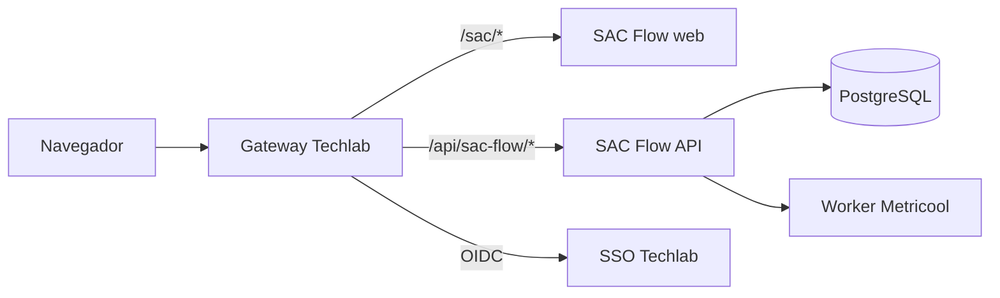

# Integración con la página web

## Recomendación

Publicar SAC Flow como aplicación autenticada bajo el mismo dominio y gateway de la web de Techlab, por ejemplo una ruta reservada como `/sac/`, y enrutar su API bajo `/api/sac-flow/`. Este enfoque comparte SSO y navegación sin acoplar el ciclo de despliegue del portal al de SAC Flow.

Evitar un iframe como solución principal: complica SSO, cookies, CSP, accesibilidad, altura responsive y deep links. Puede servir como transición temporal si Techlab no puede agregar una ruta al gateway.

## Integración inicial con los únicos insumos del propietario

La primera implementación puede operar en modo equipo interno con solo:

1. clave API del sitio, configurada como `SAC_FLOW_API_KEY` en el gateway/servidor, nunca en JavaScript público;
2. token Metricool y referencias de las cuentas autorizadas.

El bootstrap genera por sí mismo la contraseña PostgreSQL y la clave de cifrado. Con el frontend y API en mismo origen no se requiere una lista CORS adicional. El gateway debe inyectar la API key del lado servidor; si la página entrega la clave al navegador, la arquitectura no se considera aprobada. SSO/OIDC sigue recomendado cuando existan usuarios individuales, pero no bloquea un piloto interno con un único contexto administrativo y sitio privado.

### Publicación temporal en Sites

La versión de Sites no contiene una API demo ni datos ficticios. Su Worker actúa como proxy de mismo origen hacia el backend real y falla cerrado hasta que existan estas variables de runtime:

- `SAC_FLOW_API_ORIGIN`: origen HTTPS público del gateway/backend, sin ruta;
- `SAC_FLOW_API_KEY`: la misma clave exigida por el backend, almacenada como secreto.

El navegador llama `/api/*` al dominio de Sites y nunca recibe la clave. El proxy elimina credenciales aportadas por el navegador, inyecta la clave servidor-servidor, no conserva cookies externas y desactiva caché para respuestas operativas. El token Metricool permanece exclusivamente en el backend; no se configura en Sites ni en el bundle web.

Mientras falte cualquiera de los dos valores, la interfaz muestra “API real pendiente de configuración”, no habilita operaciones y no sustituye la respuesta por fixtures.

## Contrato de integración



### Frontera del portal

La página anfitriona es responsable de:

- enlace/navegación hacia SAC Flow;
- sesión SSO y shell común si aplica;
- CSP, TLS y gateway;
- pasar contexto solo mediante claims o endpoints autenticados, nunca query params confiables.

SAC Flow es responsable de:

- autorización por rol/marca en cada endpoint;
- UI, workflows y datos de SAC;
- integración Metricool y auditoría;
- estados de carga, error, acceso denegado y sesión expirada.

## Configuración de rutas

Para desarrollo, el frontend usa:

```dotenv
VITE_API_BASE_URL=/api
```

Para mismo origen en producción, compilar con una ruta relativa estable:

```dotenv
VITE_API_BASE_URL=/api/sac-flow
```

El Dockerfile acepta el mismo valor como build arg. Con Compose, definirlo en `.env` y reconstruir la imagen; no basta cambiarlo solo en el runtime porque Vite lo inserta al compilar:

```powershell
$env:VITE_API_BASE_URL='/api/sac-flow'
docker compose build
docker compose up -d
```

El gateway debe eliminar o conservar el prefijo de forma consistente con las rutas internas. Ejemplo conceptual — adaptar a la plataforma real:

```text
/sac/*              -> servicio web SAC Flow
/api/sac-flow/*     -> servicio API SAC Flow (/api/*)
```

No codificar dominios de staging/producción en componentes React.

## Base path del frontend

Si SAC Flow se aloja en `/sac/` en vez de un subdominio, Techlab debe validar:

- `base` de Vite y URLs de assets;
- fallback del router a `index.html` solo para rutas web;
- que `/api/*` y métodos de escritura no caigan en el fallback SPA;
- refresh directo en deep links;
- service workers/caché, si se añaden posteriormente.

Una alternativa con menos configuración de assets es `sac.<dominio-techlab>`, manteniendo API y cookies dentro de una política de dominios explícita.

## SSO

Preferir el patrón BFF o sesión segura en gateway/API:

1. navegador inicia OIDC en Techlab;
2. backend valida el callback y crea sesión `HttpOnly`;
3. frontend consulta `/me`/contexto y no almacena access tokens en `localStorage`;
4. API decide tenant, marcas y rol desde la sesión validada;
5. logout invalida sesión local y, si corresponde, la del proveedor.

Si Techlab usa bearer tokens, validar issuer, audience, firma, scopes y expiración en la API. Nunca confiar en `brandId` enviado por el cliente sin cruzarlo con los permisos del usuario.

Como puente de handoff, la API puede leer cabeceras `X-SAC-User-Id`, `X-SAC-Tenant-Id`, `X-SAC-Role` y `X-SAC-Brand-Ids` cuando `SAC_FLOW_TRUST_ACTOR_HEADERS=true`. Usar esto solo detrás del gateway: debe eliminar esas cabeceras si vienen del navegador y reconstruirlas desde la sesión SSO validada. En staging/producción activar además `SAC_FLOW_REQUIRE_ACTOR_CONTEXT=true`.

## CORS, cookies y CSP

Con mismo origen, no se necesita CORS para el uso normal. Si web y API están en orígenes distintos:

- allowlist exacta de orígenes;
- `Access-Control-Allow-Credentials` solo cuando sea necesario;
- cookies `Secure`, `HttpOnly` y `SameSite` acorde al flujo;
- CSRF en mutaciones con cookies;
- CSP que permita solo recursos y conexiones requeridos;
- `frame-ancestors` bloqueado salvo uso de iframe expresamente aprobado.

La API de Metricool se llama desde el servidor; no agregarla a `connect-src` del navegador ni exponer `X-Mc-Auth`.

## Navegación y UX compartida

Acordar con Techlab:

- nombre y posición de “SAC Flow” en la navegación;
- breadcrumbs y enlace de retorno;
- tokens de color/tipografía o shell del portal;
- ancho mínimo y comportamiento móvil;
- formato de fechas/zona horaria (guardar UTC, mostrar zona de marca/usuario);
- deep links para marca, bandeja e interacción;
- estados de permiso insuficiente, mantenimiento y dependencia Metricool caída.

La integración visual no debe comprometer la independencia del dominio: el portal puede pasar theme/contexto, pero la API sigue siendo la fuente autorizada.

## Estrategias posibles

| Estrategia | Ventaja | Costo/riesgo | Uso recomendado |
| --- | --- | --- | --- |
| Ruta detrás del gateway | Mismo origen, SSO simple, despliegue independiente | Configurar base path/fallback | Preferida |
| Subdominio | Assets simples y aislamiento | CORS/cookies entre dominios | Buena alternativa |
| Iframe | Integración visual rápida | SSO/CSP/a11y/deep links difíciles | Solo transición |
| Microfrontend en runtime | Shell unificado | Alto acoplamiento y complejidad | Solo si ya es estándar Techlab |
| Copiar componentes al portal | Un solo build | Pierde ownership y dificulta actualizaciones | No recomendado |

## Integración por etapas

### Etapa 1: enlace autenticado

- Dashboard, cuentas, referencias Metricool por cuenta, interacciones, detalle de conversación y settings globales ya consumen la API; la bandeja y el panel de caso crean borradores/resuelven/escalan por backend y los toggles de cuenta actualizan la allowlist. La vista **Cuentas** ya permite alta/edición/desactivación recuperable de marcas internas; completar rotación de token, SSO/RBAC y administración productiva de credenciales antes del camino live.
- Desplegar SAC Flow separado en staging.
- Agregar enlace desde el portal.
- Validar SSO, logout y permisos.

### Etapa 2: mismo gateway

- Enrutar web/API bajo rutas estables.
- Usar `VITE_API_BASE_URL` relativo.
- Probar assets, deep links, errores y caché.

### Etapa 3: experiencia común

- Aplicar tokens visuales, navegación y telemetría consentida.
- Compartir solamente el contexto de usuario/tenant necesario.

### Etapa 4: activación operativa

- Habilitar lectura Metricool para una marca.
- Expandir a 4 y luego 20.
- Habilitar respuestas manuales; automatización solo después de UAT y guardrails.

## Checklist de integración web

- [ ] Ruta/subdominio y ownership definidos.
- [ ] API base no está hardcodeada.
- [ ] Assets cargan y deep links sobreviven al refresh.
- [ ] Fallback SPA nunca oculta errores de `/api`.
- [ ] Deep link o navegación hacia detalle de interacción probado dentro del portal.
- [ ] SSO, logout, expiración y revocación probados.
- [ ] Gateway elimina cabeceras `X-SAC-*` entrantes y entrega rol/scope desde sesión validada.
- [ ] API rechaza acceso a marcas no autorizadas.
- [ ] CORS/CSRF/CSP/cookies revisados.
- [ ] Token Metricool ausente de bundle y tráfico del navegador.
- [ ] `userId`/`blogId` no aparecen en respuestas, logs, telemetría ni HTML renderizado.
- [ ] Navegación, responsive, teclado, foco y contraste verificados.
- [ ] Error de Metricool se diferencia de error de SAC Flow.
- [ ] Telemetría evita texto/PII de las conversaciones.
- [ ] Despliegue y rollback pueden hacerse sin publicar toda la web.
